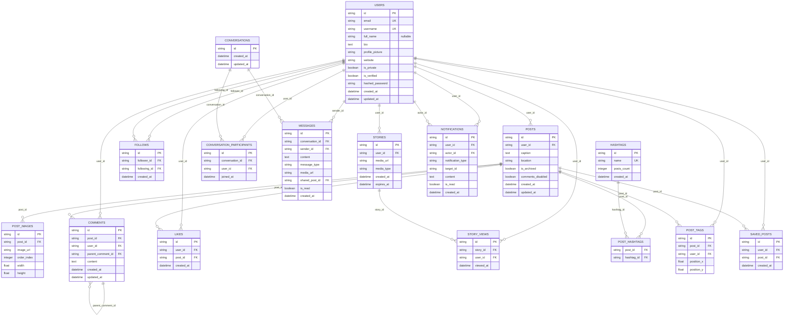

# Instagram 클론 - 데이터베이스 설계 명세서

## 데이터베이스 개요
- **개발 환경**: SQLite
- **프로덕션 환경**: PostgreSQL
- **ORM**: SQLAlchemy 2.0
- **마이그레이션**: Alembic

## 전체 ERD 구조



## 상세 테이블 설계

### 1. users (사용자)
사용자 계정 정보를 저장하는 핵심 테이블

```sql
CREATE TABLE users (
    id VARCHAR(36) PRIMARY KEY DEFAULT (UUID()),
    email VARCHAR(255) UNIQUE NOT NULL,
    username VARCHAR(30) UNIQUE NOT NULL,
    full_name VARCHAR(100),  -- 선택사항
    bio TEXT,
    profile_picture VARCHAR(500),
    website VARCHAR(200),
    is_private BOOLEAN DEFAULT FALSE,
    is_verified BOOLEAN DEFAULT FALSE,
    hashed_password VARCHAR(255) NOT NULL,
    created_at TIMESTAMP DEFAULT CURRENT_TIMESTAMP,
    updated_at TIMESTAMP DEFAULT CURRENT_TIMESTAMP ON UPDATE CURRENT_TIMESTAMP,
    
    INDEX idx_users_email (email),
    INDEX idx_users_username (username),
    INDEX idx_users_created_at (created_at)
);
```

**필드 설명:**
- `id`: UUID 기본키
- `email`: 로그인용 이메일 (유니크)
- `username`: 사용자명 (유니크, 3-30자)
- `full_name`: 실명 또는 표시명
- `bio`: 프로필 소개글 (최대 150자)
- `profile_picture`: 프로필 사진 URL
- `website`: 개인 웹사이트 URL
- `is_private`: 비공개 계정 여부
- `is_verified`: 인증 계정 여부
- `hashed_password`: 암호화된 비밀번호

### 2. posts (게시물)
사용자가 업로드한 게시물 정보

```sql
CREATE TABLE posts (
    id VARCHAR(36) PRIMARY KEY DEFAULT (UUID()),
    user_id VARCHAR(36) NOT NULL,
    caption TEXT,
    location VARCHAR(100),
    is_archived BOOLEAN DEFAULT FALSE,
    comments_disabled BOOLEAN DEFAULT FALSE,
    created_at TIMESTAMP DEFAULT CURRENT_TIMESTAMP,
    updated_at TIMESTAMP DEFAULT CURRENT_TIMESTAMP ON UPDATE CURRENT_TIMESTAMP,
    
    FOREIGN KEY (user_id) REFERENCES users(id) ON DELETE CASCADE,
    INDEX idx_posts_user_id (user_id),
    INDEX idx_posts_created_at (created_at),
    INDEX idx_posts_location (location)
);
```

**필드 설명:**
- `caption`: 게시물 설명 (최대 2200자)
- `location`: 위치 정보
- `is_archived`: 보관된 게시물 여부
- `comments_disabled`: 댓글 비활성화 여부

### 3. post_images (게시물 이미지)
게시물의 이미지/비디오 파일 정보

```sql
CREATE TABLE post_images (
    id VARCHAR(36) PRIMARY KEY DEFAULT (UUID()),
    post_id VARCHAR(36) NOT NULL,
    image_url VARCHAR(500) NOT NULL,
    order_index INTEGER NOT NULL DEFAULT 0,
    width INTEGER,
    height INTEGER,
    alt_text VARCHAR(255),
    
    FOREIGN KEY (post_id) REFERENCES posts(id) ON DELETE CASCADE,
    INDEX idx_post_images_post_id (post_id),
    INDEX idx_post_images_order (post_id, order_index)
);
```

**필드 설명:**
- `order_index`: 이미지 순서 (0부터 시작)
- `width`, `height`: 이미지 원본 크기
- `alt_text`: 접근성을 위한 대체 텍스트

### 4. comments (댓글)
게시물 댓글 및 대댓글

```sql
CREATE TABLE comments (
    id VARCHAR(36) PRIMARY KEY DEFAULT (UUID()),
    post_id VARCHAR(36) NOT NULL,
    user_id VARCHAR(36) NOT NULL,
    parent_comment_id VARCHAR(36),
    content TEXT NOT NULL,
    created_at TIMESTAMP DEFAULT CURRENT_TIMESTAMP,
    updated_at TIMESTAMP DEFAULT CURRENT_TIMESTAMP ON UPDATE CURRENT_TIMESTAMP,
    
    FOREIGN KEY (post_id) REFERENCES posts(id) ON DELETE CASCADE,
    FOREIGN KEY (user_id) REFERENCES users(id) ON DELETE CASCADE,
    FOREIGN KEY (parent_comment_id) REFERENCES comments(id) ON DELETE CASCADE,
    INDEX idx_comments_post_id (post_id),
    INDEX idx_comments_user_id (user_id),
    INDEX idx_comments_parent (parent_comment_id),
    INDEX idx_comments_created_at (created_at)
);
```

**필드 설명:**
- `parent_comment_id`: 대댓글인 경우 부모 댓글 ID
- `content`: 댓글 내용 (최대 500자)

### 5. likes (좋아요)
게시물 및 댓글 좋아요

```sql
CREATE TABLE likes (
    id VARCHAR(36) PRIMARY KEY DEFAULT (UUID()),
    user_id VARCHAR(36) NOT NULL,
    post_id VARCHAR(36),
    comment_id VARCHAR(36),
    created_at TIMESTAMP DEFAULT CURRENT_TIMESTAMP,
    
    FOREIGN KEY (user_id) REFERENCES users(id) ON DELETE CASCADE,
    FOREIGN KEY (post_id) REFERENCES posts(id) ON DELETE CASCADE,
    FOREIGN KEY (comment_id) REFERENCES comments(id) ON DELETE CASCADE,
    
    UNIQUE KEY uk_user_post_like (user_id, post_id),
    UNIQUE KEY uk_user_comment_like (user_id, comment_id),
    INDEX idx_likes_post_id (post_id),
    INDEX idx_likes_comment_id (comment_id),
    INDEX idx_likes_created_at (created_at),
    
    CONSTRAINT chk_like_target CHECK (
        (post_id IS NOT NULL AND comment_id IS NULL) OR
        (post_id IS NULL AND comment_id IS NOT NULL)
    )
);
```

### 6. follows (팔로우 관계)
사용자 간 팔로우 관계

```sql
CREATE TABLE follows (
    id VARCHAR(36) PRIMARY KEY DEFAULT (UUID()),
    follower_id VARCHAR(36) NOT NULL,
    following_id VARCHAR(36) NOT NULL,
    created_at TIMESTAMP DEFAULT CURRENT_TIMESTAMP,
    
    FOREIGN KEY (follower_id) REFERENCES users(id) ON DELETE CASCADE,
    FOREIGN KEY (following_id) REFERENCES users(id) ON DELETE CASCADE,
    
    UNIQUE KEY uk_follow_relationship (follower_id, following_id),
    INDEX idx_follows_follower (follower_id),
    INDEX idx_follows_following (following_id),
    INDEX idx_follows_created_at (created_at),
    
    CONSTRAINT chk_no_self_follow CHECK (follower_id != following_id)
);
```

### 7. stories (스토리)
24시간 후 자동 삭제되는 스토리

```sql
CREATE TABLE stories (
    id VARCHAR(36) PRIMARY KEY DEFAULT (UUID()),
    user_id VARCHAR(36) NOT NULL,
    media_url VARCHAR(500) NOT NULL,
    media_type ENUM('image', 'video') NOT NULL,
    created_at TIMESTAMP DEFAULT CURRENT_TIMESTAMP,
    expires_at TIMESTAMP NOT NULL,
    
    FOREIGN KEY (user_id) REFERENCES users(id) ON DELETE CASCADE,
    INDEX idx_stories_user_id (user_id),
    INDEX idx_stories_expires_at (expires_at),
    INDEX idx_stories_created_at (created_at)
);
```

### 8. story_views (스토리 조회)
스토리 조회 기록

```sql
CREATE TABLE story_views (
    id VARCHAR(36) PRIMARY KEY DEFAULT (UUID()),
    story_id VARCHAR(36) NOT NULL,
    user_id VARCHAR(36) NOT NULL,
    viewed_at TIMESTAMP DEFAULT CURRENT_TIMESTAMP,
    
    FOREIGN KEY (story_id) REFERENCES stories(id) ON DELETE CASCADE,
    FOREIGN KEY (user_id) REFERENCES users(id) ON DELETE CASCADE,
    
    UNIQUE KEY uk_story_view (story_id, user_id),
    INDEX idx_story_views_story_id (story_id),
    INDEX idx_story_views_user_id (user_id)
);
```

### 9. conversations (대화방)
Direct Message 대화방

```sql
CREATE TABLE conversations (
    id VARCHAR(36) PRIMARY KEY DEFAULT (UUID()),
    created_at TIMESTAMP DEFAULT CURRENT_TIMESTAMP,
    updated_at TIMESTAMP DEFAULT CURRENT_TIMESTAMP ON UPDATE CURRENT_TIMESTAMP,
    
    INDEX idx_conversations_updated_at (updated_at)
);
```

### 10. conversation_participants (대화 참여자)
대화방 참여자 정보

```sql
CREATE TABLE conversation_participants (
    id VARCHAR(36) PRIMARY KEY DEFAULT (UUID()),
    conversation_id VARCHAR(36) NOT NULL,
    user_id VARCHAR(36) NOT NULL,
    joined_at TIMESTAMP DEFAULT CURRENT_TIMESTAMP,
    last_read_at TIMESTAMP,
    
    FOREIGN KEY (conversation_id) REFERENCES conversations(id) ON DELETE CASCADE,
    FOREIGN KEY (user_id) REFERENCES users(id) ON DELETE CASCADE,
    
    UNIQUE KEY uk_conversation_participant (conversation_id, user_id),
    INDEX idx_conv_participants_conversation (conversation_id),
    INDEX idx_conv_participants_user (user_id)
);
```

### 11. messages (메시지)
Direct Message 메시지

```sql
CREATE TABLE messages (
    id VARCHAR(36) PRIMARY KEY DEFAULT (UUID()),
    conversation_id VARCHAR(36) NOT NULL,
    sender_id VARCHAR(36) NOT NULL,
    content TEXT,
    message_type ENUM('text', 'image', 'video', 'post_share', 'story_share') NOT NULL,
    media_url VARCHAR(500),
    shared_post_id VARCHAR(36),
    is_read BOOLEAN DEFAULT FALSE,
    created_at TIMESTAMP DEFAULT CURRENT_TIMESTAMP,
    
    FOREIGN KEY (conversation_id) REFERENCES conversations(id) ON DELETE CASCADE,
    FOREIGN KEY (sender_id) REFERENCES users(id) ON DELETE CASCADE,
    FOREIGN KEY (shared_post_id) REFERENCES posts(id) ON DELETE SET NULL,
    
    INDEX idx_messages_conversation (conversation_id),
    INDEX idx_messages_sender (sender_id),
    INDEX idx_messages_created_at (created_at)
);
```

### 12. hashtags (해시태그)
해시태그 마스터 테이블

```sql
CREATE TABLE hashtags (
    id VARCHAR(36) PRIMARY KEY DEFAULT (UUID()),
    name VARCHAR(100) UNIQUE NOT NULL,
    posts_count INTEGER DEFAULT 0,
    created_at TIMESTAMP DEFAULT CURRENT_TIMESTAMP,
    
    INDEX idx_hashtags_name (name),
    INDEX idx_hashtags_posts_count (posts_count)
);
```

### 13. post_hashtags (게시물-해시태그 연결)
게시물과 해시태그의 다대다 관계

```sql
CREATE TABLE post_hashtags (
    post_id VARCHAR(36) NOT NULL,
    hashtag_id VARCHAR(36) NOT NULL,
    
    PRIMARY KEY (post_id, hashtag_id),
    FOREIGN KEY (post_id) REFERENCES posts(id) ON DELETE CASCADE,
    FOREIGN KEY (hashtag_id) REFERENCES hashtags(id) ON DELETE CASCADE,
    
    INDEX idx_post_hashtags_hashtag (hashtag_id)
);
```

### 14. post_tags (게시물 사용자 태그)
게시물에 태그된 사용자 정보

```sql
CREATE TABLE post_tags (
    id VARCHAR(36) PRIMARY KEY DEFAULT (UUID()),
    post_id VARCHAR(36) NOT NULL,
    user_id VARCHAR(36) NOT NULL,
    position_x DECIMAL(5,4),  -- 0.0000 ~ 1.0000
    position_y DECIMAL(5,4),  -- 0.0000 ~ 1.0000
    
    FOREIGN KEY (post_id) REFERENCES posts(id) ON DELETE CASCADE,
    FOREIGN KEY (user_id) REFERENCES users(id) ON DELETE CASCADE,
    
    UNIQUE KEY uk_post_user_tag (post_id, user_id),
    INDEX idx_post_tags_post (post_id),
    INDEX idx_post_tags_user (user_id)
);
```

### 15. saved_posts (저장된 게시물)
사용자가 저장한 게시물

```sql
CREATE TABLE saved_posts (
    id VARCHAR(36) PRIMARY KEY DEFAULT (UUID()),
    user_id VARCHAR(36) NOT NULL,
    post_id VARCHAR(36) NOT NULL,
    created_at TIMESTAMP DEFAULT CURRENT_TIMESTAMP,
    
    FOREIGN KEY (user_id) REFERENCES users(id) ON DELETE CASCADE,
    FOREIGN KEY (post_id) REFERENCES posts(id) ON DELETE CASCADE,
    
    UNIQUE KEY uk_user_saved_post (user_id, post_id),
    INDEX idx_saved_posts_user (user_id),
    INDEX idx_saved_posts_created_at (created_at)
);
```

### 16. notifications (알림)
시스템 알림 정보

```sql
CREATE TABLE notifications (
    id VARCHAR(36) PRIMARY KEY DEFAULT (UUID()),
    user_id VARCHAR(36) NOT NULL,  -- 알림을 받을 사용자
    actor_id VARCHAR(36) NOT NULL,  -- 알림을 발생시킨 사용자
    notification_type ENUM('like', 'comment', 'follow', 'mention', 'tag') NOT NULL,
    target_id VARCHAR(36),  -- 대상 객체 ID (post_id, comment_id 등)
    content TEXT,
    is_read BOOLEAN DEFAULT FALSE,
    created_at TIMESTAMP DEFAULT CURRENT_TIMESTAMP,
    
    FOREIGN KEY (user_id) REFERENCES users(id) ON DELETE CASCADE,
    FOREIGN KEY (actor_id) REFERENCES users(id) ON DELETE CASCADE,
    
    INDEX idx_notifications_user (user_id),
    INDEX idx_notifications_is_read (is_read),
    INDEX idx_notifications_created_at (created_at)
);
```

## 데이터베이스 인덱스 전략

### 성능 최적화를 위한 주요 인덱스

1. **피드 조회 최적화**
```sql
-- 팔로우한 사용자들의 최신 게시물 조회
CREATE INDEX idx_posts_feed_optimization ON posts (user_id, created_at DESC);

-- 사용자별 게시물 카운트
CREATE INDEX idx_posts_user_count ON posts (user_id) WHERE is_archived = FALSE;
```

2. **검색 최적화**
```sql
-- 사용자명 검색
CREATE INDEX idx_users_username_search ON users (username) WHERE is_private = FALSE;

-- 해시태그 검색
CREATE INDEX idx_hashtags_search ON hashtags (name, posts_count DESC);
```

3. **메시징 최적화**
```sql
-- 대화방별 최신 메시지 조회
CREATE INDEX idx_messages_conversation_time ON messages (conversation_id, created_at DESC);

-- 읽지 않은 메시지 카운트
CREATE INDEX idx_messages_unread ON messages (conversation_id, is_read, created_at);
```

## 데이터 제약 조건

### 비즈니스 규칙 적용

1. **사용자명 제약**
```sql
ALTER TABLE users ADD CONSTRAINT chk_username_format 
CHECK (username REGEXP '^[a-zA-Z0-9._]{3,30}$');
```

2. **이메일 형식 검증**
```sql
ALTER TABLE users ADD CONSTRAINT chk_email_format 
CHECK (email REGEXP '^[A-Za-z0-9._%+-]+@[A-Za-z0-9.-]+\.[A-Za-z]{2,}$');
```

3. **게시물 이미지 개수 제한**
```sql
-- 트리거를 통해 구현 (최대 10개)
DELIMITER //
CREATE TRIGGER tr_check_post_images_limit
BEFORE INSERT ON post_images
FOR EACH ROW
BEGIN
    DECLARE image_count INT;
    SELECT COUNT(*) INTO image_count 
    FROM post_images 
    WHERE post_id = NEW.post_id;
    
    IF image_count >= 10 THEN
        SIGNAL SQLSTATE '45000' 
        SET MESSAGE_TEXT = 'Maximum 10 images per post allowed';
    END IF;
END//
DELIMITER ;
```

## 데이터 보존 및 정리 정책

### 자동 데이터 정리

1. **만료된 스토리 삭제**
```sql
-- 일일 정리 작업
DELETE FROM stories WHERE expires_at < NOW();
```

2. **오래된 알림 정리**
```sql
-- 30일 이상 된 읽은 알림 삭제
DELETE FROM notifications 
WHERE is_read = TRUE AND created_at < DATE_SUB(NOW(), INTERVAL 30 DAY);
```

## 백업 및 복구 전략

### 정기 백업 스케줄
```bash
# 일일 백업 (자정)
0 0 * * * pg_dump instagram_db > /backup/daily/instagram_$(date +\%Y\%m\%d).sql

# 주간 백업 (일요일)
0 2 * * 0 pg_dump instagram_db > /backup/weekly/instagram_$(date +\%Y\%W).sql

# 월간 백업 (매월 1일)
0 3 1 * * pg_dump instagram_db > /backup/monthly/instagram_$(date +\%Y\%m).sql
```

## 마이그레이션 전략

### Alembic 마이그레이션 예제

```python
# migrations/versions/001_initial_schema.py
"""Initial schema

Revision ID: 001
Revises: 
Create Date: 2024-01-01 00:00:00.000000

"""
from alembic import op
import sqlalchemy as sa

def upgrade():
    # users 테이블 생성
    op.create_table('users',
        sa.Column('id', sa.String(36), primary_key=True),
        sa.Column('email', sa.String(255), nullable=False),
        sa.Column('username', sa.String(30), nullable=False),
        # ... 기타 컬럼들
    )
    
    # 인덱스 생성
    op.create_index('idx_users_email', 'users', ['email'])
    op.create_index('idx_users_username', 'users', ['username'])

def downgrade():
    op.drop_table('users')
```

## 성능 모니터링

### 쿼리 성능 분석
```sql
-- 느린 쿼리 식별
SELECT query, mean_time, calls, total_time
FROM pg_stat_statements
ORDER BY mean_time DESC
LIMIT 10;

-- 인덱스 사용률 확인
SELECT schemaname, tablename, indexname, idx_scan, idx_tup_read, idx_tup_fetch
FROM pg_stat_user_indexes
ORDER BY idx_scan DESC;
```

이 데이터베이스 설계는 Instagram의 핵심 기능을 모두 지원하면서도 확장성과 성능을 고려한 구조입니다. 필요에 따라 추가 테이블이나 인덱스를 생성하여 기능을 확장할 수 있습니다.